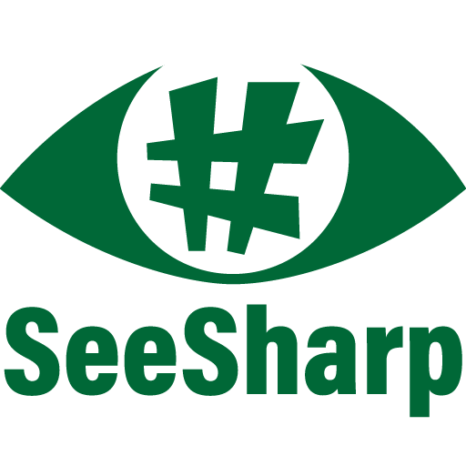

<a href="https://www.nuget.org/packages/SeeSharp/"></a>

# SeeSharp

SeeSharp is a flexibility-first framework for rapid prototyping of rendering algorithms.
Currently, it only works with triangle meshes and only handles surface interactions.
The framework implements some basic integrators, namely unidirectional and bidirectional path tracing,
photon mapping, and vertex connection and merging.
These offer a range of virtual functions to easily and cleanly inject additional logic, like
better importance sampling, path guiding, and so on.

Images being rendered can be streamed interactively to the [tev](https://github.com/tom94/tev) image viewer, via sockets.

Additionally, the framework offers utility classes to render comparisons of different integrators and/or settings.
That is, we use C# to implement the integrators and logic, and as the scripting language to run experiments.

An example of how to successfully use this framework to conduct experiments for a research paper can be found
in the implementation of our [EG 2021 paper on correlation-aware MIS](https://github.com/pgrit/MisForCorrelatedBidir).

## Getting started

### Dependencies

We use [TinyEmbree](https://github.com/pgrit/TinyEmbree), a simple C# wrapper around [Embree](embree.org),
for ray tracing, and [SimpleImageIO](https://github.com/pgrit/SimpleImageIO), a C# wrapper around TinyEXR and
stb_image. On 64 Bit Windows or Linux, you should be able to use the pre-built binaries included in the
nuget packages (linked by default):

<a href="https://www.nuget.org/packages/TinyEmbree/"> TinyEmbree</a>

<a href="https://www.nuget.org/packages/SimpleImageIO/"> SimpleImageIO</a>

On other platforms you will need to build these from source. Instructions how to do that can be found in the respective README.md files.
After building your platform specific version of these, the easiest way is to pack them as a local nuget package.
For example:

```
mkdir ~/LocalNuget
dotnet nuget add source ~/LocalNuget

cd [TinyEmbree ROOT]
dotnet pack -c Release
cp TinyEmbree/bin/Release/TinyEmbree.0.1.1.nupkg ~/LocalNuget
```

An alternative is to replace the `<PackageReference .../>` in `SeeSharp.csproj` by a `<ProjectReference .../>` to your local
TinyExr.csproj, which also allows you to more easily modify both.

### Testing

The unit tests can be run via a simple

```
dotnet test
```

The validation test, which ensure that all integrators agree on the same results for a number of trivial test scenes,
can be run in Release mode via:

```
dotnet run -p Validation -c Release
```

Note that the validation tests assume that they are run from within the root directory of this project, as they
rely on some scene files stored in the `Data` directory.

### Exporting a scene from Blender

SeeSharp comes with a simple export script for Blender, that can export triangle meshes, cameras,
and a small subset of Cycles materials, to SeeSharp's file format. The script is called
`src/BlendToSeeSharp.py`
To use the script, simply load and run it within Blender.

Currently, we export the geometry of each frame to an .obj file. If the scene has an HDR background (not a constant color
or sky model) it is exported as well. For the materials, we map the following:

- DiffuseBSDF: either with a constant color or a texture, roughness is ignored
- PrincipledBSDF: roughly mapped to our GenericMaterial, which currently ignores SSS and clearcoat. Also,
only the BaseColor can be textured at the moment
- Emission: mapped to a black body diffuse surface with diffuse emission properties
- The viewport preview color and roughness, if all else fails

That is, for most existing scenes, you will need to manually simplify the usually complex shader graphs to
one of the above, else only the viewport settings will be used.

Note that, for now, the conventions are not matched perfectly.
The camera FOV is not exactly the same and HDR backgrounds will be horizontally flipped.
This is a known bug that will be fixed eventually.


### Conducting an experiment

### With a project

SeeSharp is designed to be used as a library, to write rendering experiments with.
To get started, you should first create a new console application that will contain you experiment set-up,
as well as any additional algorithms or other changes you will introduce.

```
dotnet new console -o MyFirstExperiment
cd MyFirstExperiment
dotnet add package SeeSharp
```

Now, you can implement new or derived integrators and write your own experiment setup,
for instance by deriving a class from `ExperimentFactory`.

### In a script

Another option is to use [.NET interactive](https://github.com/dotnet/interactive) in a Jupyter notebook.
Or, you could write a [C# script](https://github.com/filipw/dotnet-script) or F# script.

The following example of a .csx script conducts an experiment that compares a path tracer to the vertex connection and merging algorithm, at equal sample count:
```C#
#r "nuget: SeeSharp, 0.2.0"

using SeeSharp;
using SeeSharp.Core;
using SeeSharp.Core.Image;
using SeeSharp.Experiments;
using SeeSharp.Integrators;
using SeeSharp.Integrators.Bidir;

// Configure the experiment we want to run: test scene, maximum depth,
// best reference integrator, which methods to compare.
class MySimpleExperiment : ExperimentFactory {
    // Specify the scene and how to render references
    public override Scene MakeScene() => Scene.LoadFromFile("cbox.json");
    public override Integrator MakeReferenceIntegrator()
    => new PathTracer { MaxDepth = 5, TotalSpp = 128 };

    // Specify the methods (named integrators) to compare
    public override List<Method> MakeMethods() => new() {
        new("PathTracer", new PathTracer() { MaxDepth = 5, TotalSpp = 4 }),
        new("Vcm", new VertexConnectionAndMerging() { MaxDepth = 5, NumIterations = 2 })
    };
}

// The Benchmark class can be used to run multiple experiments,
// for example to render different test scenes or different configurations.
Benchmark bench = new(new Dictionary<string, ExperimentFactory>() {
    { "CornellBox", new MySimpleExperiment() },
}, 640, 480) { DirectoryName = "Results" };
bench.Run();

// Optional, but usually a good idea: assemble the rendering results in an overview
// figure using a Python script.
Process.Start("python", "./MakeFigure.py Results PathTracer Vcm").WaitForExit();
```

The first line automatically downloads and installs the SeeSharp package using nuget. Hence, you can simply run the experiment via:


```
dotnet script MyExperiment.csx
```

Alternatively, you could paste the same code in the cells of a .ipynb and run it with Jupyter. Then, you can even display the generated figure right underneath.

In this example, we automatically invoke Python, which is assumed to be in the PATH,
to assemble the rendered images in a comparison figure. We use [figuregen](https://github.com/Mira-13/figure-gen) for that, so make sure to run:

```
python -m pip install figuregen
```

The content of `MakeFigure.py` is below:

```Python
import figuregen
from figuregen import util
import pyexr
import sys, os

def tonemap(img):
    return figuregen.PNG(util.image.lin_to_srgb(img))

def make_figure(dirname, method_names):
    # Read the files
    ref = pyexr.read(os.path.join(dirname, "reference.exr"))
    methods = [
        pyexr.read(os.path.join(dirname, name, "render.exr"))
        for name in method_names
    ]
    errors = [ f"{util.image.relative_mse(m, ref):.2f}" for m in methods ]

    # Put side by side and write error values underneath
    grid = figuregen.Grid(1, len(method_names) + 1)
    grid.get_element(0, 0).set_image(tonemap(ref)).set_caption("Error (relMSE):")
    for i in range(len(methods)):
        e = grid.get_element(0, i + 1)
        e.set_image(tonemap(methods[i]))
        e.set_caption(errors[i])
    grid.get_layout().set_caption(3, fontsize=8, offset_mm=1)

    # Assemble in an 18cm wide .pdf figure using the LaTeX backend
    figuregen.horizontal_figure([grid], 18, "Overview.pdf")

if __name__ == "__main__":
    # Get the directory names from the command line arguments
    result_dir = sys.argv[1]
    method_names = []
    for i in range(2, len(sys.argv)):
        method_names.append(sys.argv[i])

    # Generate the figure
    make_figure(os.path.join(result_dir, "CornellBox"), method_names)
```

## Coding conventions

The framework loosely follows the following coding conventions:

- Class names, method names, properties, and public fields are PascalCase
- Private fields, parameters, and local variables are camelCase
- Opening brackets are on the same line
- Lines should be less than 110 characters long, for better readability and comparisons

The .editorconfig and omnisharp.json files configure some of these conventions for Visual Studio and VS Code, respectively.

Example:

```C#
class SomeClass {
    public int PublicField = 1;
    public int PublicProperty => 13;
    public void ComputeSomething(byte complexParameterName, int anotherVeryLongParameterName,
                                 SomeClass mysteriousParameterThatIsNotNamedWell) {
        if (complexParameterName == PublicProperty) {
            int localName = 5;
            implementationDetail = $"SeeSharp {localName}";
        }
    }
    string implementationDetail;
}
```
