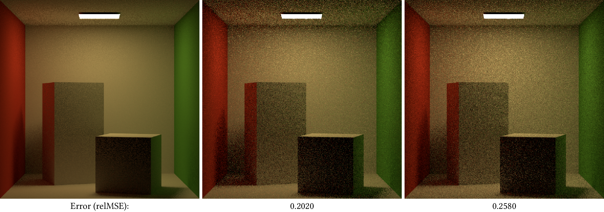

<a href="https://www.nuget.org/packages/SeeSharp/">
    
</a>

# SeeSharp

SeeSharp is a flexibility-first framework for rapid prototyping of rendering algorithms.
Currently, it only works with triangle meshes and only handles surface interactions.
The framework implements some basic integrators, namely unidirectional and bidirectional path tracing,
photon mapping, and vertex connection and merging.
These offer a range of virtual functions to easily and cleanly inject additional logic, like
better importance sampling, path guiding, and so on.

Images being rendered can be streamed interactively to the [tev](https://github.com/tom94/tev) image viewer, via sockets.

Additionally, the framework offers utility classes to render comparisons of different integrators and/or settings.
That is, we use C# to implement the integrators and logic, and as the scripting language to run experiments.

An example of how to successfully use this framework to conduct experiments for a research paper can be found
in the implementation of our [EG 2021 paper on correlation-aware MIS](https://github.com/pgrit/MisForCorrelatedBidir).

## Getting started

### Dependencies

We use [TinyEmbree](https://github.com/pgrit/TinyEmbree), a simple C# wrapper around [Embree](https://www.embree.org/),
for ray tracing, and [SimpleImageIO](https://github.com/pgrit/SimpleImageIO), a C# wrapper around [TinyEXR](https://github.com/syoyo/tinyexr) and
[stb_image](https://github.com/nothings/stb). On 64 Bit Windows, Linux, or macOS, you should be able to use the pre-built binaries included in the
nuget packages. These are linked by default, so you do not need to do anything and can skip ahead to the next section.

On other platforms you will need to build these from source. Instructions how to do that can be found in the respective README.md files.
After building your platform specific version of these, the easiest way is to pack them as a local nuget package.
For example:

```
mkdir ~/LocalNuget
dotnet nuget add source ~/LocalNuget

cd [TinyEmbree ROOT]
dotnet pack -c Release
cp TinyEmbree/bin/Release/TinyEmbree.[VERSION].nupkg ~/LocalNuget
```

An alternative is to replace the `<PackageReference .../>` in `SeeSharp.csproj` by a `<ProjectReference .../>` to your local
TinyEmbree.csproj, which also allows you to more easily modify both.

> **Note**: The .fbx loader is currently relying on Assimp.NET. On Linux (and maybe MacOS) you might see a
> "library not found" exception for `libassimp.so`. In that case, you need to manually install  `libminizip`.
> (Linking `libassimp.so` fails if that dependency is not found. It is not bundled in the NuGet package).

### Testing

The unit tests can be run via a simple

```
dotnet test
```

The validation test, which ensure that all integrators agree on the same results for a number of trivial test scenes,
can be run in Release mode via:

```
dotnet run --project SeeSharp.Validation -c Release
```

Note that the validation tests assume that they are run from within the root directory of this project, as they
rely on some scene files stored in the `Data` directory.

### Exporting a scene from Blender

SeeSharp comes with a very basic Blender add-on. The `see_blender.zip` file is automatically [built for each release](https://github.com/pgrit/SeeSharp/releases). You can install it in Blender via `Edit -> Preferences -> Add-ons -> Install...`. Check [the docs](https://docs.blender.org/manual/en/latest/editors/preferences/addons.html) for more details.

When building locally, you can run `build_blender.bat` or `build_blender.sh` to generate the Blender add-on.

The add-on currently handles two things: exporting a scene to our `.json` format and rendering a preview when hitting F12 (final render only, viewport rendering not yet supported). These are very rudimentary and might not work for all possible Blender features and scene configurations.
Also, the add-on offers some basic GUI support to configure material parameters and add an HDR background.

Some simple Cycles materials can be converted to a SeeSharp material. Currently, there is a coarse mapping from:

- DiffuseBSDF: either with a constant color or a texture, roughness is ignored
- PrincipledBSDF: roughly mapped to our GenericMaterial, which currently ignores SSS, sheen, and clearcoat. Also,
only BaseColor and roughness can be textured at the moment
- Emission: mapped to a diffuse black body emitter
- The viewport preview color and roughness, if all else fails

For most existing scenes, you will need to manually simplify the usually complex shader graphs to
one of the above, else only the viewport settings will be used.

All materials in the entire scene can be converted via `File -> Import -> Convert all materials to SeeSharp`.
Converting an individual material is also possible, via a button in that material's parameter settings.

### Conducting an experiment

### With a project

SeeSharp is designed to be used as a library, to write rendering experiments with.
To get started, you should first create a new console application that will contain you experiment set-up,
as well as any additional algorithms or other changes you will introduce.

```
dotnet new console -o MyFirstExperiment
cd MyFirstExperiment
dotnet add package SeeSharp
```

Now, you can implement new or derived integrators and write your own experiment setup,
for instance by deriving a class from `ExperimentFactory`.

### In a script

Another option is to use [.NET interactive](https://github.com/dotnet/interactive) in a Jupyter notebook.
Or, you could write a [C# script](https://github.com/filipw/dotnet-script) or F# script.

The following example of a .csx script conducts an experiment that compares a path tracer to the vertex connection and merging algorithm, at equal sample count:
```C#
#r "nuget: SeeSharp, 1.4.0"

using System.Collections.Generic;
using System.Diagnostics;
using SeeSharp.Experiments;
using SeeSharp.Image;
using SeeSharp.Integrators;
using SeeSharp.Integrators.Bidir;

// Configure an experiment that compares VCM and path tracing.
class PathVsVcm : Experiment {
    public override List<Method> MakeMethods() => new() {
        new("PathTracer", new PathTracer() { MaxDepth = 5, TotalSpp = 4 }),
        new("Vcm", new VertexConnectionAndMerging() { MaxDepth = 5, NumIterations = 2 })
    };
}

// Register the directory as a scene file provider.
// Asides from the geometry, it is also used as a reference image cache.
SceneRegistry.AddSource("Data/Scenes");

// Configure a benchmark to compare path tracing and VCM on the CornellBox
// at 512x512 resolution. Display images in tev during rendering (localhost, default port)
Benchmark benchmark = new(new PathVsVcm(), new() {
    SceneRegistry.LoadScene("CornellBox", maxDepth: 5),
    SceneRegistry.LoadScene("CornellBox", maxDepth: 2).WithName("CornellBoxDirectIllum")
}, "Results/PathVsVcm", 512, 512, FrameBuffer.Flags.SendToTev);

// Render the images
benchmark.Run(format: ".exr");

// Optional, but usually a good idea: assemble the rendering results in an overview
// figure using a Python script.
Process.Start("python", "./SeeSharp.Examples/MakeFigure.py Results/PathVsVcm PathTracer Vcm")
    .WaitForExit();

// For our README file, we further convert the pdf to png with ImageMagick
Process.Start("magick", "-density 300 ./Results/PathVsVcm/Overview.pdf ExampleFigure.png")
    .WaitForExit();
```

The first line automatically downloads and installs the SeeSharp package using nuget. Hence, you can simply run the experiment via:


```
dotnet script MyExperiment.csx
```

Alternatively, you could paste the same code in the cells of a .ipynb and run it with Jupyter. Then, you can even display the generated figure right underneath.

In this example, we automatically invoke Python, which is assumed to be in the PATH,
to assemble the rendered images in a comparison figure. We use [figuregen](https://github.com/Mira-13/figure-gen) for that, so make sure to run:

```
python -m pip install figuregen
```

And here's the generated overview figure:



The project-file based version of this example, as well as the [MakeFigure.py](SeeSharp.Examples/MakeFigure.py) script, can be found in the [SeeSharp.Examples](SeeSharp.Examples) directory.

## Coding conventions

The framework loosely follows the following coding conventions:

- Class names, method names, properties, and public fields are PascalCase
- Private fields, parameters, and local variables are camelCase
- Opening brackets are on the same line
- Lines should be less than 110 characters long, for better readability and comparisons

The .editorconfig and omnisharp.json files configure some of these conventions for Visual Studio and VS Code, respectively.

Example:

```C#
class SomeClass {
    public int PublicField = 1;
    public int PublicProperty => 13;
    public void ComputeSomething(byte complexParameterName, int anotherVeryLongParameterName,
                                 SomeClass mysteriousParameterThatIsNotNamedWell) {
        if (complexParameterName == PublicProperty) {
            int localName = 5;
            implementationDetail = $"SeeSharp {localName}";
        }
    }
    string implementationDetail;
}
```
